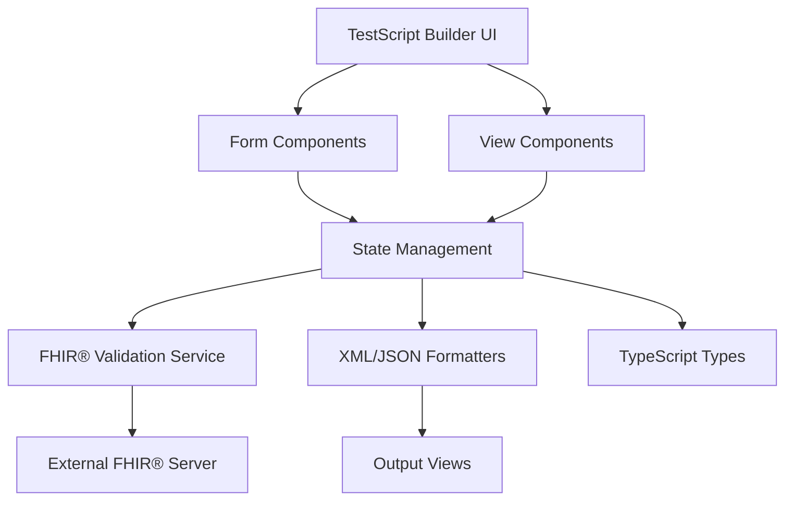
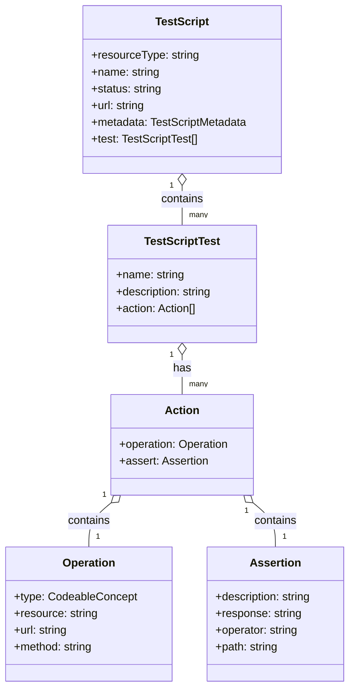

# TestFhiry TinkerTool

Ein modernes Web-Tool zur visuellen Erstellung und Verwaltung von FHIR® TestScript-Ressourcen. Ermöglicht die Erstellung komplexer TestScripts ohne manuelle XML/JSON-Bearbeitung.

## Inhaltsverzeichnis

- [Einleitung](#einleitung)
- [Kernfunktionen](#kernfunktionen)
- [Verzeichnisstruktur](#verzeichnisstruktur)
- [Funktionalitäten](#funktionalitäten)
- [Architekturüberblick](#architekturüberblick)
- [Codebase Overview](#codebase-overview)
- [Setup & Installation](#setup--installation)
- [Konfiguration](#konfiguration)
- [Ausführen](#ausführen)
- [Deployment](#deployment)
- [Troubleshooting](#troubleshooting)
- [Limitierungen](#limitierungen)
- [Roadmap](#roadmap)
- [Externe Quellen](#externe-quellen)

## Einleitung

### Zielsetzung
TinkerTool vereinfacht die Erstellung von FHIR® TestScripts durch eine intuitive, visuelle Benutzeroberfläche. Das Tool ermöglicht es Entwicklern, TestScripts ohne tiefe FHIR®-Kenntnisse zu erstellen.

### Aktuelle Funktionalität
- TestScript-Erstellung mit visuellen Formularen
- Echtzeit-Validierung gegen FHIR® R5 Standards
- Export in XML und JSON Format

## Kernfunktionen

- **Visueller TestScript Builder** - Formular-basierte Erstellung von FHIR® TestScripts
- **Live-Vorschau** - Echtzeit-Anzeige in XML, JSON und strukturierter Form
- **FHIR® R4/R5 Unterstützung** - Version-spezifische Features (z.B. Scope nur in R5)
- **FHIR® R5 Validierung** - Integration mit FHIR®-Servern für automatische Validierung
- **Modulare Architektur** - Saubere Trennung von UI, Logik und Services
- **Type-Safety** - Vollständige TypeScript-Unterstützung mit FHIR®-Typen
- **Common Actions (Custom Feature)** - Wiederverwendbare Actions mit Parametern (nicht im FHIR®-Standard)

## Verzeichnisstruktur

```
.
├─ app/                          # Next.js App Router
│  ├─ api/validate/              # FHIR®-Validierungs-API
│  ├─ globals.css               # Globale Styles
│  ├─ layout.tsx                # Root Layout
│  └─ page.tsx                   # Hauptseite
├─ components/                   # React-Komponenten
│  ├─ form-builder/             # Formular-Builder Module
│  │  ├─ sections/              # Formular-Sektionen
│  │  ├─ shared/                # Wiederverwendbare Komponenten
│  │  └─ form-builder.tsx       # Haupt-Form-Builder
│  ├─ test-script-builder/      # TestScript Builder Module
│  ├─ ui/                       # shadcn/ui Komponenten
│  └─ *.tsx                     # Weitere Komponenten
├─ hooks/                        # Custom React Hooks
│  └─ use-FHIR®-validation.ts    # FHIR®-Validierung Hook
├─ lib/                         # Utilities und Services
│  ├─ formatters/              # JSON/XML Formatierung
│  ├─ services/                # FHIR®-Validierungs-Service
│  └─ utils.ts                  # Hilfsfunktionen
├─ types/                       # TypeScript-Typen
│  ├─ test-script.ts           # TestScript-spezifische Typen
│  └─ validation.ts             # Validierungs-Typen
├─ public/                      # Statische Assets
└─ README.md
```

### Verzeichnis-Zweck

**app/**: Next.js App Router mit Seiten, Layouts und API-Routes. Enthält die Hauptanwendung und FHIR®-Validierungs-Endpoint.

**components/**: Alle React-Komponenten der Anwendung. Form-Builder für TestScript-Erstellung, UI-Komponenten und View-Renderer.

**hooks/**: Custom React Hooks für State-Management und FHIR®-Validierung.

**lib/**: Utility-Funktionen, Services und Formatter. Enthält FHIR®-Validierungslogik und Formatierungstools.

**types/**: TypeScript-Typdefinitionen für TestScripts und Validierung.

## Funktionalitäten

### TestScript Builder
- **Zweck:** Visuelle Erstellung von FHIR® TestScripts über Formulare
- **Eingaben:** Benutzer-Eingaben über Formulare (Name, Status, Actions, Assertions)
- **Ausgaben:** Vollständiges FHIR® TestScript in JSON/XML Format
- **Nebenbedingungen:** FHIR® R5 Konformität, Validierung gegen FHIR®-Server

### Live-Vorschau
- **Zweck:** Echtzeit-Anzeige des generierten TestScripts
- **Eingaben:** Aktueller TestScript-State
- **Ausgaben:** Formatierte Darstellung in XML, JSON und strukturierter Form
- **Nebenbedingungen:** Automatische Aktualisierung bei Änderungen

### FHIR®-Validierung
**Zweck:** Automatische Validierung gegen FHIR® R5 Standards
**Eingaben:** TestScript-Objekt
**Ausgaben:** Validierungsergebnisse mit Fehlern und Warnungen
**Nebenbedingungen:** Verbindung zu FHIR®-Server erforderlich

## Architekturüberblick

Die Anwendung folgt einer modularen Architektur mit klarer Trennung zwischen UI, Geschäftslogik und externen Services. Der Datenfluss erfolgt unidirektional von der UI über State-Management zu Services und zurück.

### Komponentendiagramm



### Sequenzdiagramm


### UML-Klassendiagramm



## Codebase Overview

### app/
**Zweck:** Next.js App Router mit Seiten und API  
**Hauptdateien:** 
- `page.tsx` → Hauptseite mit TestScript Builder
- `layout.tsx` → Root Layout mit Theme Provider
- `api/validate/route.ts` → FHIR®-Validierungs-API

### components/
**Zweck:** Alle UI-Komponenten der Anwendung  
**Hauptdateien:**
- `test-script-builder.tsx` → Haupt-Builder-Komponente
- `form-builder/` → Formular-Komponenten für TestScript-Erstellung
- `structured-view.tsx` → Hierarchische TestScript-Darstellung
- `xml-view.tsx` → XML-Output mit Syntax-Highlighting
- `json-view.tsx` → JSON-Output
- `validation-tab.tsx` → Validierungsergebnisse

### lib/
**Zweck:** Geschäftslogik, Services und Utilities  
**Hauptdateien:**
- `services/FHIR®-validation-service.ts` → FHIR®-Server-Validierung
- `formatters/xml-formatter.ts` → XML-Generierung
- `formatters/json-formatter.ts` → JSON-Formatierung
- `initial-data.ts` → Standard-TestScript-Template
- `utils.ts` → CSS-Klassen-Hilfsfunktionen

### types/
**Zweck:** TypeScript-Typdefinitionen  
**Hauptdateien:**
- `test-script.ts` → Vollständige FHIR® TestScript-Typen
- `validation.ts` → Validierungs-Ergebnis-Typen

### hooks/
**Zweck:** Custom React Hooks für State-Management  
**Hauptdateien:**
- `use-FHIR®-validation.ts` → FHIR®-Validierung mit State-Management

## Setup & Installation
### wichtige Abhängigkeiten:
- Next.js 15.2.4 (Framework)
- React 19.0.0 (UI-Library)
- TypeScript 5 (Type-Safety)
- Tailwind CSS 4 (Styling)
- Radix UI (Komponenten)
- xmlbuilder2 (XML-Generierung)

### Voraussetzungen
- Node.js 18 oder höher
- npm oder yarn
- Git

### Installationsschritte

1. **Repository klonen**
   ```bash
   git clone https://github.com/username/testscript-crafter.git
   cd testscript-crafter
   ```

2. **Abhängigkeiten installieren**
   ```bash
   npm install
   ```

3. **Entwicklungsserver starten**
   ```bash
   npm run dev
   ```

4. **Browser öffnen**
   - Navigiere zu `http://localhost:3000`

### Umgebungsvariablen

Erstelle `.env.local` für lokale Konfiguration:

```bash
# FHIR® Server für Validierung
NEXT_PUBLIC_FHIR_SERVER_URL=https://hapi.fhir.org/baseR5

# Optional: Custom Validierungs-URL
NEXT_PUBLIC_VALIDATION_ENDPOINT=/api/validate
```

## Konfiguration

### Standardwerte
- FHIR® Server: `https://hapi.fhir.org/baseR5`
- Validierungs-Endpoint: `/api/validate`
- Theme: System (automatische Dark/Light Mode Erkennung)

### Überschreibung
Konfiguration erfolgt über Umgebungsvariablen in `.env.local` oder über die Next.js-Konfiguration in `next.config.ts`.

## Ausführen

### Entwicklung
```bash
npm run dev          # Entwicklungsserver mit Turbopack
```

### Produktion
```bash
npm run build        # Produktions-Build
npm run start        # Produktions-Server
```

### Beispiel-Workflows

**TestScript erstellen:**
1. Anwendung starten
2. Grundinformationen eingeben
3. Metadaten konfigurieren
4. Test-Cases hinzufügen
5. Validierung durchführen
6. Export als XML/JSON

**Validierung:**
- Automatische Validierung bei Änderungen
- Manuelle Validierung über Validierung-Tab
- Fehler werden in Echtzeit angezeigt

## Deployment

### Vercel (Empfohlen)
```bash
npm i -g vercel
vercel --prod
```

### Andere Plattformen
- Netlify: Automatisches Deployment über Git
- Docker: Container-basierte Deployment
- Traditionelle Hosting-Provider: Statische Builds

### Health-Checks
- `/api/validate` Endpoint für Validierung
- Automatische FHIR®-Server-Verbindungstests

## Troubleshooting

### Häufige Fehler

**"Module not found" Fehler:**
- `npm install` erneut ausführen
- Node.js Version prüfen (18+ erforderlich)

**FHIR®-Validierung schlägt fehl:**
- Internetverbindung prüfen
- FHIR®-Server-URL in Umgebungsvariablen prüfen
- CORS-Einstellungen des FHIR®-Servers prüfen

**Build-Fehler:**
- TypeScript-Fehler in `next.config.ts` deaktiviert
- ESLint-Fehler werden ignoriert
- Bei Problemen: `npm run build` mit Debug-Output

### Logs
- Browser-Konsole für Client-seitige Fehler
- Terminal für Server-seitige Logs
- Network-Tab für API-Anfragen

## Limitierungen
- Große TestScripts (>1MB) können Performance-Probleme verursachen
- Validierung ist abhängig von externen FHIR®-Servern
- Offline-Modus nicht vollständig unterstützt

## Roadmap

### Mögliche Nächste Schritte (Q1 2025)
1. **Erweiterte Assertion-Typen** - Mehr Validierungsoptionen für komplexe Tests
2. **Template-System** - Vorgefertigte TestScript-Templates für häufige Use Cases
3. **Batch-Import** - Import mehrerer TestScripts gleichzeitig
4. **Erweiterte Validierung** - Lokale Validierung ohne externe Server
5. **Export-Optimierungen** - Mehr Ausgabeformate (YAML, CSV)
6. **Performance-Optimierung** - Lazy Loading für große TestScripts
7. **Dokumentation** - Interaktive Tutorials und Beispiele

### Out-of-Scope
- FHIR®-Server-Implementierung
- Test-Ausführung (nur TestScript-Erstellung)
- Multi-User-Kollaboration
- Versionierung von TestScripts

## Externe Quellen
- HL7 FHIR® - Standards und Spezifikationen
- shadcn/ui - UI-Komponenten-Bibliothek
- Next.js Team - React-Framework
- Radix UI - Barrierefreie Komponenten
- Tailwind CSS - Utility-First CSS-Framework

---

